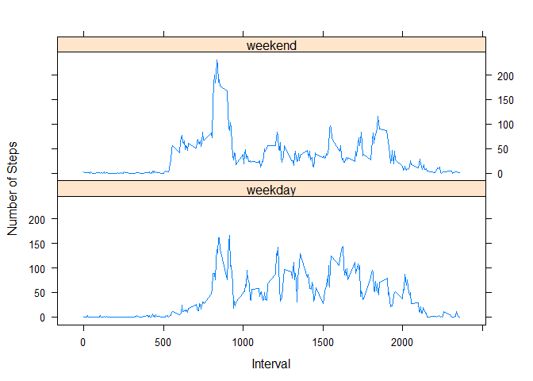

# Reproducible Research: Peer Assessment 1


## Loading and preprocessing the data


```r
#unzip the file
file <- unzip("activity.zip")
#read the file
df1 <- read.csv(file, header = TRUE, sep = ",", na.strings = "NA", nrows = 17568)

#assingn  to another data frame so we can use for later analysis 
df2 <- df1

#geta clean dataframe without NAs
df3 <- na.omit(df1)
```

## What is mean total number of steps taken per day?


```r
library(sqldf)
```

```
## Loading required package: gsubfn
## Loading required package: proto
## Loading required package: RSQLite
## Loading required package: DBI
```

```r
Tot <- sqldf("select sum(steps) from df3 group by date ")
```

```
## Loading required package: tcltk
```

```r
colnames(Tot) <- "steps"
```
#### 1. Total number of steps taken per day

```r
print(Tot)
```

```
##    steps
## 1    126
## 2  11352
## 3  12116
## 4  13294
## 5  15420
## 6  11015
## 7  12811
## 8   9900
## 9  10304
## 10 17382
## 11 12426
## 12 15098
## 13 10139
## 14 15084
## 15 13452
## 16 10056
## 17 11829
## 18 10395
## 19  8821
## 20 13460
## 21  8918
## 22  8355
## 23  2492
## 24  6778
## 25 10119
## 26 11458
## 27  5018
## 28  9819
## 29 15414
## 30 10600
## 31 10571
## 32 10439
## 33  8334
## 34 12883
## 35  3219
## 36 12608
## 37 10765
## 38  7336
## 39    41
## 40  5441
## 41 14339
## 42 15110
## 43  8841
## 44  4472
## 45 12787
## 46 20427
## 47 21194
## 48 14478
## 49 11834
## 50 11162
## 51 13646
## 52 10183
## 53  7047
```

#### 2. Histogram of total number of steps taken

```r
par(mfrow = c(1,1))

hist(Tot$steps , breaks = 25, ylim = c(0,10), col = 'brown', xlab = 'Sum of Steps', bg = 'white', main = 'Number of Steps per day')
```

 


```r
MMPDay <- sqldf("select date as Date, AVG(steps) as Mean, ((max(steps) + min(steps)) / 2)  as Median from df3 group by date ")
```

#### 3.Mean and Median of the total number of steps taken.

```r
print(MMPDay)
```

```
##          Date       Mean Median
## 1  2012-10-02  0.4375000     58
## 2  2012-10-03 39.4166667    306
## 3  2012-10-04 42.0694444    273
## 4  2012-10-05 46.1597222    277
## 5  2012-10-06 53.5416667    263
## 6  2012-10-07 38.2465278    261
## 7  2012-10-09 44.4826389    374
## 8  2012-10-10 34.3750000    206
## 9  2012-10-11 35.7777778    374
## 10 2012-10-12 60.3541667    401
## 11 2012-10-13 43.1458333    271
## 12 2012-10-14 52.4236111    270
## 13 2012-10-15 35.2048611    393
## 14 2012-10-16 52.3750000    379
## 15 2012-10-17 46.7083333    372
## 16 2012-10-18 34.9166667    379
## 17 2012-10-19 41.0729167    256
## 18 2012-10-20 36.0937500    266
## 19 2012-10-21 30.6284722    250
## 20 2012-10-22 46.7361111    391
## 21 2012-10-23 30.9652778    249
## 22 2012-10-24 29.0104167    266
## 23 2012-10-25  8.6527778    221
## 24 2012-10-26 23.5347222    220
## 25 2012-10-27 35.1354167    277
## 26 2012-10-28 39.7847222    266
## 27 2012-10-29 17.4236111    295
## 28 2012-10-30 34.0937500    261
## 29 2012-10-31 53.5208333    378
## 30 2012-11-02 36.8055556    376
## 31 2012-11-03 36.7048611    266
## 32 2012-11-05 36.2465278    392
## 33 2012-11-06 28.9375000    315
## 34 2012-11-07 44.7326389    383
## 35 2012-11-08 11.1770833    179
## 36 2012-11-11 43.7777778    270
## 37 2012-11-12 37.3784722    271
## 38 2012-11-13 25.4722222    222
## 39 2012-11-15  0.1423611     16
## 40 2012-11-16 18.8923611    237
## 41 2012-11-17 49.7881944    376
## 42 2012-11-18 52.4652778    392
## 43 2012-11-19 30.6979167    394
## 44 2012-11-20 15.5277778    250
## 45 2012-11-21 44.3993056    379
## 46 2012-11-22 70.9270833    283
## 47 2012-11-23 73.5902778    380
## 48 2012-11-24 50.2708333    392
## 49 2012-11-25 41.0902778    275
## 50 2012-11-26 38.7569444    354
## 51 2012-11-27 47.3819444    403
## 52 2012-11-28 35.3576389    366
## 53 2012-11-29 24.4687500    284
```

## What is the average daily activity pattern?

```r
library(lattice)

AveStepsInt <- sqldf("select interval, AVG(steps) as Mean from df3 group by interval ")
```
#### 1. Time series plot of 5 min interval and average steps taken.

```r
xyplot(AveStepsInt$Mean ~ AveStepsInt$interval,
        data = AveStepsInt,
        type = "l", lty = c(1, 2, 2, 1),
        xlab = "Interval", ylab = "Average Steps"
       )
```

 

####2. Which 5-minute interval, on average across all the days in the dataset, contains the maximum number of steps?


```r
maxInt <- sqldf(" select interval from AveStepsInt where Mean = (select MAX(Mean) from AveStepsInt)")

print(maxInt)
```

```
##   interval
## 1      835
```

## Imputing missing values
### Strategy is to to fill with mean of interval for NA's while counting them and create a new dataset with missing values filled in (this covers 2 & 3 of the instruction for assignment)

```r
TotalNas <- 0

for(i in 1:17568) {
        if (is.na(df1$steps[i])) {  
            m =df1$interval[i]
            df2$steps[i] <- as.integer(sqldf(paste("select Mean from AveStepsInt where interval = " ,m)))
            TotalNas <- TotalNas + 1
            
        }
}

colnames(df2) <- c("steps", "date", "interval")
```
#### 1. Total number of rows for steps with NA values

```r
print(TotalNas)
```

```
## [1] 2304
```
### 4. Histogram after Imputing

```r
Tot2 <- sqldf("select sum(steps) from df2 group by date ")
colnames(Tot2) <- "steps"

par(mfrow = c(1,1))

hist(Tot2$steps , breaks = 25,, ylim = c(0,10), col = 'brown', xlab = 'Sum of Steps', bg = 'white', main = 'Number of Steps per day')
```

 

### 4. Mean and Median after imputing

```r
MMPDay2 <- sqldf("select date as Date, AVG(steps) as Mean, ((max(steps) + min(steps)) / 2)  as Median from df2 group by date ")

MMPDay2$Median <- as.integer(MMPDay2$Median)

print(MMPDay2)
```

```
##          Date       Mean Median
## 1  2012-10-01 36.9479167    103
## 2  2012-10-02  0.4375000     58
## 3  2012-10-03 39.4166667    306
## 4  2012-10-04 42.0694444    273
## 5  2012-10-05 46.1597222    277
## 6  2012-10-06 53.5416667    263
## 7  2012-10-07 38.2465278    261
## 8  2012-10-08 36.9479167    103
## 9  2012-10-09 44.4826389    374
## 10 2012-10-10 34.3750000    206
## 11 2012-10-11 35.7777778    374
## 12 2012-10-12 60.3541667    401
## 13 2012-10-13 43.1458333    271
## 14 2012-10-14 52.4236111    270
## 15 2012-10-15 35.2048611    393
## 16 2012-10-16 52.3750000    379
## 17 2012-10-17 46.7083333    372
## 18 2012-10-18 34.9166667    379
## 19 2012-10-19 41.0729167    256
## 20 2012-10-20 36.0937500    266
## 21 2012-10-21 30.6284722    250
## 22 2012-10-22 46.7361111    391
## 23 2012-10-23 30.9652778    249
## 24 2012-10-24 29.0104167    266
## 25 2012-10-25  8.6527778    221
## 26 2012-10-26 23.5347222    220
## 27 2012-10-27 35.1354167    277
## 28 2012-10-28 39.7847222    266
## 29 2012-10-29 17.4236111    295
## 30 2012-10-30 34.0937500    261
## 31 2012-10-31 53.5208333    378
## 32 2012-11-01 36.9479167    103
## 33 2012-11-02 36.8055556    376
## 34 2012-11-03 36.7048611    266
## 35 2012-11-04 36.9479167    103
## 36 2012-11-05 36.2465278    392
## 37 2012-11-06 28.9375000    315
## 38 2012-11-07 44.7326389    383
## 39 2012-11-08 11.1770833    179
## 40 2012-11-09 36.9479167    103
## 41 2012-11-10 36.9479167    103
## 42 2012-11-11 43.7777778    270
## 43 2012-11-12 37.3784722    271
## 44 2012-11-13 25.4722222    222
## 45 2012-11-14 36.9479167    103
## 46 2012-11-15  0.1423611     16
## 47 2012-11-16 18.8923611    237
## 48 2012-11-17 49.7881944    376
## 49 2012-11-18 52.4652778    392
## 50 2012-11-19 30.6979167    394
## 51 2012-11-20 15.5277778    250
## 52 2012-11-21 44.3993056    379
## 53 2012-11-22 70.9270833    283
## 54 2012-11-23 73.5902778    380
## 55 2012-11-24 50.2708333    392
## 56 2012-11-25 41.0902778    275
## 57 2012-11-26 38.7569444    354
## 58 2012-11-27 47.3819444    403
## 59 2012-11-28 35.3576389    366
## 60 2012-11-29 24.4687500    284
## 61 2012-11-30 36.9479167    103
```
## Impact after imputing missing date

#### Surprisingly the graph, mean and median hasnt changed much at all
#### well it make sense since we are filling in with mean value which shouldnt really affect the median/mean/graph. We do have additional rows of data due to imputing.


## Are there differences in activity patterns between weekdays and weekends?


```r
#create a vector of weekdays
df2$day <- weekdays(as.Date(df2$date))
weekdays1 <- c('Monday', 'Tuesday', 'Wednesday', 'Thursday', 'Friday')
#Use `%in%` and `weekdays` to create a logical vector
#convert to `factor` and specify the `levels/labels`
df2$wDay <-  factor((df2$day %in% weekdays1)+1L,
      levels=1:2, labels=c('weekday', 'weekend'))
```

## Making a time series panel plot for weekdays versus weekends

#### 1. Creating a new factor variable in the dataset with two levels -- "weekday" and "weekend" indicating whether a given date is a weekday or weekend day.


```r
library(lattice)
AveStepsInt2 <- sqldf("select interval,
                      wDay,
                      AVG(steps) as Mean 
                      from df2 
                      where wDay = 'weekday'
                      group by interval ")
AveStepsInt3 <- sqldf("select interval,
                      wDay,
                      AVG(steps) as Mean 
                      from df2 
                      where wDay = 'weekend'
                      group by interval ")


df4 <- rbind(AveStepsInt3, AveStepsInt2)
```

#### 2. Panel Plot containing time series for 5 min interval and average number of steps of taken.


```r
xyplot(Mean ~ interval | wDay, 
        data = df4,
        layout=c(1,2),
        type = "l", lty = c(1, 2, 2, 1),
        xlab = "Interval", ylab = "Number of Steps"
       )
```

 

